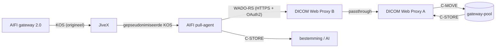

# AIFI Pull Agent — handleiding (versie 1.1)

De pull-agent staat aan de **ontvangende kant**. Hij krijgt via JiveX de KOS van de AIFI
gateway (een DICOM Key Object Selection), haalt de studie op via de DICOM Web Proxy aan zijn
kant en stuurt hem met C-STORE naar de bestemming (AI-toepassing of PACS). Beide DICOM Web
Proxies blijven ongewijzigd; alleen hun configuratie telt.

**Nieuw in 1.1** (hoort bij gateway 2.0):
- De KOS komt nu van JiveX. JiveX heeft hem gepseudonimiseerd met zijn eigen profiel. De
  agent gebruikt daaruit alleen wat dat profiel overlaat.
- De agent haalt de **hele studie** op (`GET /studies/{uid}`). Hij vraagt niet meer per serie.
- Staat de route niet meer in de KOS, dan leest de agent hem uit de opgehaalde beelden.
- Alleen KOS-objecten van de AIFI gateway worden geaccepteerd (`listener.acceptAnyKos`).

## 1. Hoe een ophaalopdracht verloopt

1. **KOS ontvangen.** De agent accepteert alleen de SOP-klasse Key Object Selection
   (`1.2.840.10008.5.1.4.1.1.88.59`) met een AIFI-kenmerk. Dat is de Manufacturer
   `AIFI Anonymization Gateway`, de Series Description `AIFI route=…` of de tekst
   `AIFI route=…`. Hij leest:
   - de **StudyInstanceUID**: het pseudoniem van JiveX, dezelfde UID als in de gateway-pool;
   - de **route**: uit de tekst of de Series Description, als JiveX die heeft laten staan;
   - het **aantal instances**: uit de tekst, anders geteld in de *Current Requested Procedure
     Evidence Sequence*. De UID's daarin mogen door JiveX hernummerd zijn; alleen het aantal
     telt.

   De opdracht wordt eerst op schijf gezet; pas daarna krijgt de afzender `Success`. Een KOS
   die opnieuw binnenkomt, levert geen tweede opdracht op (ook niet tot 30 dagen na
   afronding).
2. **Wachten.** De gateway pseudonimiseert de studie pas na het versturen van de KOS. De
   eerste poging volgt daarom na `retry.firstAttemptDelaySeconds` (standaard 10 s).
3. **Ophalen.** Eén WADO-RS-verzoek per studie bij proxy B (`GET …/studies/{study}`). B haalt
   via passthrough bij proxy A op, en A doet een C-MOVE bij de gateway-pool. Alleen instances
   van deze studie worden bewaard.
   - Nog niets beschikbaar (404): later opnieuw.
   - Minder instances dan de KOS noemt: wat er is, wordt afgeleverd, en de studie wordt
     later nog eens opgehaald. Al afgeleverde instances worden dan overgeslagen.
4. **Route bepalen.** Staat er geen route in de KOS, dan leest de agent hem uit de eerste
   opgehaalde instance: private tag `(0009,xx11)` met creator `AIFIGW`, die de gateway in elk
   beeld zet. Een route in de KOS gaat altijd voor.
5. **Doorsturen.** C-STORE naar de bestemming van de route. Elke geaccepteerde instance wordt
   vastgelegd voordat de lokale kopie wordt verwijderd.
6. **Klaar** als de studie compleet is opgehaald en elke instance is geaccepteerd. Anders
   volgt een nieuwe poging met oplopende wachttijd.

## 2. Installatie

1. Java 11 of nieuwer. Pak `aifi-pull-agent-dist_<versie>.zip` uit, bv. naar
   `C:\aifi-pull-agent\`.
2. `aifi-pull-agent.bat` → **[1] Test all connections**. De eerste keer wordt
   `config\pull-agent.yaml` aangemaakt; vul die in (§3) en herhaal **[1]** tot alles `OK` is.
3. **[5] Install and start as a Windows service** (als administrator), bij voorkeur onder een
   eigen serviceaccount. `config\`, `spool\` en `logs\` worden afgeschermd.
4. Open in de firewall de poort van de agent (standaard 11300) alleen voor de JiveX die de
   KOS doorstuurt.

## 3. Instellingen (`config\pull-agent.yaml`)

| Sectie | Betekenis |
|---|---|
| `listener` | AE-titel/poort waarop de KOS binnenkomt; `allowedCallingAeTitles` = de JiveX die hem doorstuurt; `acceptAnyKos: false` = alleen AIFI-KOS |
| `source` | proxy B: `baseUrl` (`https://…:8484/dicom-web`), `authMode` `OAUTH2` (client-id + secret van een client op proxy B) of `API_KEY`, `trustCertPath` = certificaat van proxy B |
| `destinations` | per route een bestemming (`route: ai-thorax`); `route: "*"` vangt alle andere routes, ook een onbekende |
| `workers` | opdrachten tegelijk |
| `retry` | eerste poging na 10 s; daarna 96 pogingen, oplopend tot 30 minuten (ongeveer 2 dagen); daarna FAILED |
| `spool` | opdrachten en opgehaalde instances onderweg; `minFreeMb`: daaronder worden nieuwe KOS-berichten geweigerd |

`source.instanceFetchThreshold` van versie 1.0 wordt niet meer gebruikt. Hij mag blijven
staan.

Secrets (`clientSecret`, `apiKey`, wachtwoorden) worden bij de start in het bestand versleuteld
(`enc:v1:…`, met `config\pull-agent.key`).

**Proxy B** moet staan op `pacs.retrieveMode: WADO_PASSTHROUGH` met `wadoPassthrough.baseUrl`
naar proxy A, `bsnRewrite.enabled: false`, en de agent als client. **Proxy A** haalt met
`pacs.retrieveMode: CMOVE` op bij de gateway-pool. Voorbeelden voor beide staan in
`docs\proxy-config\` (`proxy-A-verzendkant.yaml`, `proxy-B-ontvangkant.yaml`). Staat
`auth.wadoAllowedCidrs` op B, zet daar het IP-adres van de agent in.

**JiveX** moet zijn gepseudonimiseerde kopie van de KOS naar de agent routeren (AE
`AIFIPULL`, poort 11300). Laat het JiveX-profiel de Manufacturer staan; anders herkent de
agent de KOS niet als AIFI-opdracht (of zet `listener.acceptAnyKos: true`).

## 4. Beveiliging

- Naar proxy B: altijd HTTPS, TLS 1.3/1.2 met alleen forward-secret AEAD-ciphers, certificaat
  en hostnaam worden gecontroleerd, geen systeem-proxy, geen redirects. Token en secret komen
  nooit in de log.
- DICOM TLS is mogelijk op de listener en per bestemming; bij elke start meldt de log welke
  verbindingen onversleuteld over het netwerk gaan.
- De agent ziet alleen gepseudonimiseerde gegevens. Opgehaalde instances staan alleen in de
  spool zolang ze onderweg zijn.
- Een KOS zonder AIFI-kenmerk wordt geweigerd (status `C000`), zodat een verkeerde
  routeringsregel in JiveX geen willekeurige studies laat ophalen.
- Eén proces per spool: een tweede agent op dezelfde map weigert te starten.

## 5. Beheer

| Commando (`java -jar aifi-pull-agent.jar …` of via het menu) | Doel |
|---|---|
| `check` | configuratie valideren; token + health-check bij proxy B; C-ECHO naar elke bestemming |
| `status` | opdrachten: KOS-UID, route, status, aantal instances, geleverd, pogingen, laatste fout |
| `retry <job>` / `retry all` | opdracht(en) opnieuw proberen (de service pakt het binnen een minuut op) |

Log: `logs\pull-agent.0.log`. Een route die uit de beelden is gelezen, staat als `[?]` in de
eerste regels van de opdracht en daarna met naam.

## 6. Probleemoplossing

| Melding | Oorzaak en oplossing |
|---|---|
| `no destination configured for route 'x'` | voeg een bestemming toe met `route: x` of `route: "*"`; de opgehaalde instances blijven bewaard en gaan daarna verder |
| `the study is not (yet) available at the source` | de gateway heeft de studie nog niet aangeboden (sleutel van JiveX, pseudonimiseren); de agent probeert het later opnieuw. Blijft het: `status` op de gateway |
| `only n of m instance(s) available at the source so far` | proxy A kreeg niet alles uit de pool; de agent haalt de studie later opnieuw op |
| `HTTP 401 … credential refused` / `invalid_client` | `source.clientId`/`clientSecret` (of `apiKey`) klopt niet voor proxy B |
| `HTTP 403` | IP-adres van de agent staat niet in `auth.wadoAllowedCidrs` van proxy B |
| `HTTP 503` | proxy B bereikt proxy A niet: controleer `wadoPassthrough` op B en de client van B op A |
| `the certificate does not name the host` | gebruik in `baseUrl` een naam/IP die in het certificaat van proxy B staat |
| `C-STORE to … failed` / `refused … with status 0x…` | bestemming onbereikbaar of weigert de AE-titel `AIFIPULL`/het SOP-type |
| `Refusing KOS … not a Key Object Selection document` | JiveX stuurt iets anders dan de KOS van de gateway door |
| `Refusing KOS … not a pull request of the AIFI gateway` | het JiveX-profiel verwijdert ook de Manufacturer, of het is een andere KOS; zie §3 |
