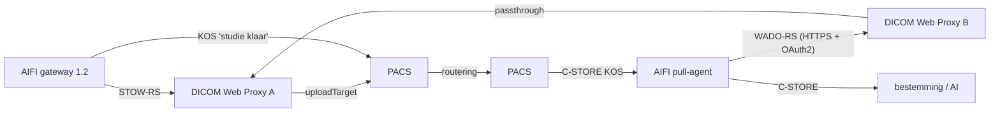

# AIFI Pull Agent — handleiding

De pull-agent staat aan de **ontvangende kant**. Hij krijgt van de AIFI gateway een
"studie klaar"-bericht (een DICOM Key Object Selection, KOS), haalt de studie op via de DICOM
Web Proxy aan zijn kant en stuurt hem met C-STORE naar de bestemming (AI-toepassing of PACS).
Beide DICOM Web Proxies blijven ongewijzigd; alleen hun configuratie telt.

## 1. Hoe een ophaalopdracht verloopt

1. **KOS ontvangen.** De agent accepteert alleen de SOP-klasse Key Object Selection
   (`1.2.840.10008.5.1.4.1.1.88.59`). Hij leest de gepseudonimiseerde StudyInstanceUID, per
   serie de instances uit de *Current Requested Procedure Evidence Sequence* en de route uit de
   tekst `AIFI route=<naam>`. De opdracht wordt eerst op schijf gezet; pas daarna krijgt de
   afzender `Success`. Een KOS die opnieuw binnenkomt, levert geen tweede opdracht op (ook niet
   tot 30 dagen na afronding).
2. **Ophalen.** Per serie een WADO-RS-verzoek bij proxy B
   (`GET …/studies/{study}/series/{series}`); B haalt de studie via passthrough bij proxy A.
   Alleen instances die in de KOS staan worden bewaard; de rest wordt genegeerd.
3. **Doorsturen.** De opgehaalde instances gaan met C-STORE naar de bestemming die bij de
   route hoort. Elke door de bestemming geaccepteerde instance wordt vastgelegd voordat de
   lokale kopie wordt verwijderd.
4. **Klaar of later opnieuw.** Zijn alle instances uit de KOS geaccepteerd, dan is de opdracht
   klaar. Ontbreekt er nog iets (bijvoorbeeld omdat de studie nog niet compleet bij proxy A
   staat), dan probeert de agent het later opnieuw. Ontbreken er maar een paar instances
   (`instanceFetchThreshold`, standaard 50), dan haalt hij alleen die afzonderlijk op in plaats
   van de hele serie opnieuw.

## 2. Installatie

1. Java 11 of nieuwer. Pak `aifi-pull-agent-dist_<versie>.zip` uit, bv. naar
   `C:\aifi-pull-agent\`.
2. `aifi-pull-agent.bat` → **[1] Test all connections**. De eerste keer wordt
   `config\pull-agent.yaml` aangemaakt; vul die in (§3) en herhaal **[1]** tot alles `OK` is.
3. **[5] Install and start as a Windows service** (als administrator), bij voorkeur onder een
   eigen serviceaccount. `config\`, `spool\` en `logs\` worden afgeschermd.
4. Open in de firewall de poort van de agent (standaard 11300) alleen voor de PACS die de KOS
   doorstuurt.

## 3. Instellingen (`config\pull-agent.yaml`)

| Sectie | Betekenis |
|---|---|
| `listener` | AE-titel/poort waarop de KOS binnenkomt; `allowedCallingAeTitles` = de PACS die hem doorstuurt |
| `source` | proxy B: `baseUrl` (`https://…:8484/dicom-web`), `authMode` `OAUTH2` (client-id + secret van een client op proxy B) of `API_KEY`, `trustCertPath` = certificaat van proxy B |
| `destinations` | per route een bestemming (`route: ai-thorax`); `route: "*"` vangt alle andere routes |
| `workers` | opdrachten tegelijk |
| `retry` | 96 pogingen, oplopend tot 30 minuten (ongeveer 2 dagen), daarna FAILED |
| `spool` | opdrachten en opgehaalde instances onderweg; `minFreeMb`: daaronder worden nieuwe KOS-berichten geweigerd |

Secrets (`clientSecret`, `apiKey`, wachtwoorden) worden bij de start in het bestand versleuteld
(`enc:v1:…`, met `config\pull-agent.key`).

**Proxy B** moet staan op `pacs.retrieveMode: WADO_PASSTHROUGH` met `wadoPassthrough.baseUrl`
naar proxy A, `bsnRewrite.enabled: false`, en de agent als client. Voorbeelden voor beide proxies
staan in `docs\proxy-config\` (`proxy-A-verzendkant.yaml`, `proxy-B-ontvangkant.yaml`). Staat `auth.wadoAllowedCidrs` op B, zet daar het IP-adres van de
agent in.

## 4. Beveiliging

- Naar proxy B: altijd HTTPS, TLS 1.3/1.2 met alleen forward-secret AEAD-ciphers, certificaat
  en hostnaam worden gecontroleerd, geen systeem-proxy, geen redirects. Token en secret komen
  nooit in de log.
- DICOM TLS is mogelijk op de listener en per bestemming; bij elke start meldt de log welke
  verbindingen onversleuteld over het netwerk gaan.
- De agent ziet alleen gepseudonimiseerde gegevens. Opgehaalde instances staan alleen in de
  spool zolang ze onderweg zijn.
- Eén proces per spool: een tweede agent op dezelfde map weigert te starten.

## 5. Beheer

| Commando (`java -jar aifi-pull-agent.jar …` of via het menu) | Doel |
|---|---|
| `check` | configuratie valideren; token + health-check bij proxy B; C-ECHO naar elke bestemming |
| `status` | opdrachten: KOS-UID, route, status, aantal instances, geleverd, pogingen, laatste fout |
| `retry <job>` / `retry all` | opdracht(en) opnieuw proberen (de service pakt het binnen een minuut op) |

Log: `logs\pull-agent.0.log`.

## 6. Probleemoplossing

| Melding | Oorzaak en oplossing |
|---|---|
| `no destination configured for route 'x'` | voeg een bestemming toe met `route: x` of `route: "*"`; de opdracht wacht en gaat daarna verder |
| `… not (yet) available at the source` | de studie staat nog niet (compleet) bij proxy A; de agent probeert het later opnieuw |
| `HTTP 401 … credential refused` / `invalid_client` | `source.clientId`/`clientSecret` (of `apiKey`) klopt niet voor proxy B |
| `HTTP 403` | IP-adres van de agent staat niet in `auth.wadoAllowedCidrs` van proxy B |
| `HTTP 503` | proxy B bereikt proxy A niet: controleer `wadoPassthrough` op B en de client van B op A |
| `the certificate does not name the host` | gebruik in `baseUrl` een naam/IP die in het certificaat van proxy B staat |
| `C-STORE to … failed` / `refused … with status 0x…` | bestemming onbereikbaar of weigert de AE-titel `AIFIPULL`/het SOP-type |
| `Refusing KOS … not a Key Object Selection document` | de PACS stuurt iets anders dan de KOS van de gateway door |
